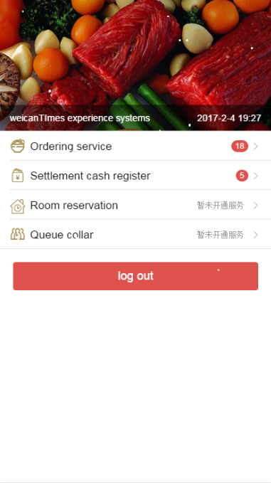

# 开发日志

### 安装

``` bash

# install dependencies
cnpm install

# serve with hot reload at localhost:8080
npm run dev

# start server at localhost:8090
cd server
node xxxx.js

```

### 界面展示
  
  
  
  
    

### 技术栈
  
  此demo在实现上使用了以下技术
  - vue
  - vuex
  - vue-cli
  - vue-router
  - v-tap
  - mui
  - webpack-zepto
  - fastclick
  - layer

### 第一天

> 制定计划，调整心情，安排时间，搭建环境，明确需求，确定目标，面向实现，化繁为简，完成搭建，上传github，择日再战，视死如归 

### 第二天

> 使用Mui分别开发出login、index、menu、desk、balance 五大核心界面
